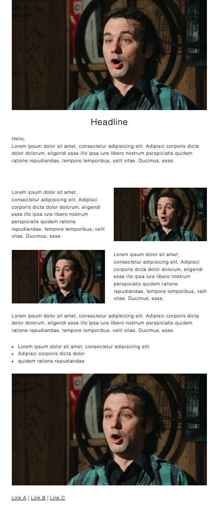

# html-email

A template and a set of rules to write HTML emails

## Rules

- The use of tables is weird but ensures better compatibility between email renderers
- Styles are added to the `head` element on purpose.
- use colspan to set the cell width (1 - 12)
- Use jpeg for images
- Use img tag and avoid background-image css
- To test how email clients render the page just open the page in a browser, `cmd` + `a`
to select all, `cmd` + `c` to copy the selection and then `cmd` + `v` in the email body
to paste the content.
- When the page is ready is best to inline css to maximize compatibility with email renderers

## Inline CSS

    npm run inline-css
    
## Resources

- https://www.npmjs.com/package/juice

## Screenshot

